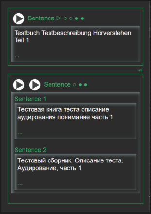

  

# Kardenwort Anki Templates

 

**Kardenwort Anki Templates** is a set of feature-rich, interactive, and aesthetically clean Anki note types designed for serious language learners. It serves as the visual and auditory canvas for the data generated by the `kardenwort` processing engine, transforming structured text into beautiful, functional, and highly effective flashcards.

This project is not just about looks; it's about intelligent design. The templates are engineered to present a wealth of information—from contextual sentences to IPA, morphemes, and AI-generated definitions—in a minimalist, uncluttered interface that puts you in control of your learning.

## Table of Contents
- [Kardenwort Anki Templates](#kardenwort-anki-templates)
  - [Table of Contents](#table-of-contents)
  - [The Core Philosophy](#the-core-philosophy)
  - [The Kardenwort Ecosystem](#the-kardenwort-ecosystem)
  - [Key Features](#key-features)
  - [The Note Types in Detail](#the-note-types-in-detail)
    - [1. Basic (Kardenwort)](#1-basic-kardenwort)
    - [2. Cloze (Kardenwort)](#2-cloze-kardenwort)
  - [Installation and Setup](#installation-and-setup)
  - [Field Reference Guide](#field-reference-guide)
    - [Core Source Fields (L1/Source Language)](#core-source-fields-l1source-language)
    - [Core Destination Fields (L2/Target Language)](#core-destination-fields-l2target-language)
    - [Context Fields](#context-fields)
    - [AI-Enhanced Fields](#ai-enhanced-fields)
    - [Detailed Linguistic Fields](#detailed-linguistic-fields)
    - [Bilingual Helper Fields](#bilingual-helper-fields)
    - [Media \& Metadata Fields](#media--metadata-fields)
    - [System Fields](#system-fields)
  - [Customization](#customization)
  - [License and Acknowledgements](#license-and-acknowledgements)

---

## The Core Philosophy

The design of these templates is guided by three principles:

1.  **Progressive Disclosure:** A flashcard should not be a wall of text. Our templates use interactive, collapsible sections that reveal information on demand. This reduces cognitive load and allows you to focus only on what you need at that moment.
2.  **Audio First:** Language is sound. The templates are built around audio, with smart scripts that automatically play the most relevant sound (source word, destination sentence, etc.) to train your ear and improve pronunciation.
3.  **Context is King:** A word learned in isolation is a word quickly forgotten. Every card is designed to display the word or sentence in its original context, ensuring you learn how language is *used*, not just what it *means*.

[Return to Top](#table-of-contents)

---

## The Kardenwort Ecosystem

These templates are the presentation layer of a powerful, three-part language learning pipeline:

1.  **`kardenwort`**: The core engine. It performs the heavy lifting of text processing (NLP) and generates a structured TSV file with over 80 fields of rich data.
2.  **`kardenwort-anki-csv-importer`**: The bridge. A script that programmatically imports the generated TSV file into Anki, mapping the data to the correct fields in these templates.
3.  **`kardenwort-anki-templates` (This Project):** The canvas. The Anki note types that intelligently display the imported data, providing the interactive and audio-rich user experience.

[Return to Top](#table-of-contents)

---

## Key Features

*   **Interactive Collapsible Sections:** A clean, minimalist layout where you click to expand sections like "Definition," "Context," or "Wordlist."
*   **Dynamic Field Display:** Fields and entire sections only appear if they contain data. Section labels use indicators (`●`/`○`) to signal the presence of content at a glance.
*   **Smart, Automatic Audio Playback:** A custom JavaScript automatically plays the most relevant audio on card load. It intelligently distinguishes between the front/back of a card and the Anki previewer to play the correct sound (e.g., source word on the front, destination sentence on the back).
*   **Integrated Text-to-Speech (TTS):** Heavily integrated with Anki's native TTS (`{{tts ...}}`), supporting multiple languages and accents (`en-GB`, `en-US`, `de-DE`, `uk-UA`, `ru-RU`) right out of the box.
*   **Comprehensive Data Support:** Designed to display over 80 fields, including IPA, inflected forms, morphemes, contextual sentences, AI-generated definitions, and more.
*   **Two Powerful Note Types:** Includes a versatile "Basic" card for vocabulary and sentences, and a specialized "Cloze" card for testing recall within a sentence.
*   **Mobile-Friendly Design:** Includes specific adjustments to ensure a smooth and functional experience on AnkiDroid.

[Return to Top](#table-of-contents)

---

## The Note Types in Detail

### 1. Basic (Kardenwort)

This is the workhorse template, designed for both individual vocabulary words and full sentences.

*   **Front Side:** Presents the source word (`WordSource`) or source sentence (`SentenceSource`). All information is hidden by default in collapsible sections, encouraging active recall. Audio for the source material plays automatically.
*   **Back Side:** Reveals the destination (translated) word and sentence, along with all other detailed information (definitions, context, etc.), again organized into collapsible sections. Audio for the destination material plays automatically.

### 2. Cloze (Kardenwort)

This template is a variation of the Basic type, specifically for creating "fill-in-the-blank" style cards.

*   **Front Side:** Displays a sentence with one or more words hidden (`{{cloze:SentenceSourceCloze}}`).
*   **Back Side:** Reveals the full sentence with the hidden word highlighted. It then displays all the same rich, collapsible sections as the Basic card, providing full context for the cloze deletion.

[Return to Top](#table-of-contents)

---

## Installation and Setup

1.  **Prerequisite:** You must have [Anki Desktop](https://apps.ankiweb.net/) installed.
2.  **Download:** Go to the [Releases page](https://github.com/kardenwort/20250913123501-kardenwort-anki-templates/releases) of this repository.
3.  **Get the Deck File:** Download the latest `.apkg` file (e.g., `Kardenwort.Templates.v1.2.5.apkg`).
4.  **Import into Anki:** Open Anki Desktop, go to `File > Import...`, and select the `.apkg` file you downloaded.

This will add the note types "Basic (Kardenwort)" and "Cloze (Kardenwort)" to your Anki collection. They will now be available for use, especially when importing data generated by the `kardenwort` tool.

[Return to Top](#table-of-contents)

---

## Field Reference Guide

The templates are designed to work with the 82-column TSV file generated by `kardenwort`. Below are the most important fields and their functions.

### Core Source Fields (L1/Source Language)

| Field | Description |
| :--- | :--- |
| `WordSource` | The base form (lemma) of the word in the source language. |
| `WordSourceInflectedForm` | The original, inflected form of the word as it appeared in the text. |
| `SentenceSource` | The full source sentence where the word was found. |
| `SentenceSourceCloze`| The source sentence formatted for a cloze deletion test. |

### Core Destination Fields (L2/Target Language)

| Field | Description |
| :--- | :--- |
| `WordDestination` | The translation of the `WordSource`. |
| `SentenceDestination` | The translation of the `SentenceSource`. |
| `SentenceDestination2`| A second, alternative translation of the source sentence. |

### Context Fields

| Field | Description |
| :--- | :--- |
| `SentenceSourceContextLeft` | The sentence(s) immediately preceding the `SentenceSource`. |
| `SentenceSourceContextRight`| The sentence(s) immediately following the `SentenceSource`. |
| `SentenceDestinationContextLeft`| The translated sentence(s) preceding the `SentenceDestination`. |
| `SentenceDestinationContextRight`| The translated sentence(s) following the `SentenceDestination`. |

### AI-Enhanced Fields

| Field | Description |
| :--- | :--- |
| `WordSourceDefinitionAISentenceSource` | An AI-generated definition of the `WordSource` in the source language. |
| `WordSourceDefinitionAISentenceDestination`| An AI-generated definition of the `WordSource` in the target language. |
| `SentenceSourceRewriteAISentenceSource`| An AI-generated simplification or rephrasing of the `SentenceSource`. |
| `WordSourceSynonymAI` | A list of synonyms for the `WordSource` generated by an AI. |
| `WordSourceMorphologyAI` | An AI-generated morphological breakdown of the `WordSource`. |

### Detailed Linguistic Fields

| Field | Description |
| :--- | :--- |
| `WordSourceIPA` | The International Phonetic Alphabet (IPA) transcription of the `WordSource`. |
| `SentenceSourceWordlist`| A list of all unique lemmas found in the `SentenceSource`. |
| `WordSourceMorphemeFirst`, `...Fifth` | Fields for breaking down a word into its constituent morphemes. |
| `WordSourceDefinitionFirst`, `...Second` | Fields for dictionary definitions of the source word. |

### Bilingual Helper Fields

| Field | Description |
| :--- | :--- |
| `WordEnglish`, `SentenceEnglish` | Dedicated fields for English translations. |
| `WordUkrainian`, `SentenceUkrainian` | Dedicated fields for Ukrainian translations. |

### Media & Metadata Fields

| Field | Description |
| :--- | :--- |
| `WordSourceAudio`, `SentenceSourceAudio`| Fields for pre-recorded audio files. If empty, TTS is used. |
| `Image` | Field for displaying an associated image. |
| `Deck` | Used by `kardenwort` to create hierarchical decks automatically. |
| `Note` | A general-purpose field for personal notes or comments. |

### System Fields

| Field | Description |
| :--- | :--- |
| `Source-en-GB`, `Destination-de-DE`, etc. | Control fields to trigger TTS for a specific language/accent. Fill with `1`. |
| `ToggleAlwaysEmptyField` | A utility field used to control certain template behaviors. |

[Return to Top](#table-of-contents)

---

## Customization

You can easily customize the Text-to-Speech voices and speeds.

1.  In Anki, go to `Tools > Manage Note Types`.
2.  Select "Basic (Kardenwort)" or "Cloze (Kardenwort)" and click `Cards...`.
3.  In the template editor, look for lines containing `{{tts ...}}`.
4.  You can change the parameters, for example: `{{tts en_US voices=Microsoft_Zira speed=0.9:WordSource}}`.

Refer to the [Anki Manual](https://docs.ankiweb.net/templates/text-to-speech.html) for a full list of available voices and options.

[Return to Top](#table-of-contents)

---

## License and Acknowledgements

This project was created by and is maintained by **Denis Novikov (voothi)**.

It is licensed under the **MIT License**. See the `LICENSE` file for details.

This project would not be possible without the incredible, open-source Anki ecosystem.

[Return to Top](#table-of-contents)